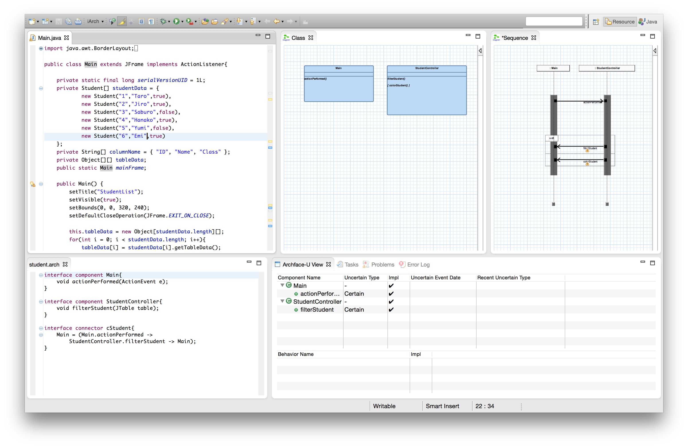

# What is iArch-U?

Uncertainty can appear in all aspects of software development: uncertainty in requirements analysis, design decisions, implementation and testing.
As the research on uncertainty is so young, there are many issues to be tackled.
Modularity for uncertainty is one of them.
If uncertainty can be dealt with modularly, we can add or delete uncertain concerns to/from models, code and tests whenever these concerns arise or are fixed to certain concerns.

The _iArch-U_ Integrated Development Environment (IDE) has been developed for that purpose by the members of [Principles of Software Languages (POSL) research group](http://posl.ait.kyushu-u.ac.jp/index.html).
iArch-U supports development with uncertainty management using interface component called _Archface-U_.
Archface-U is a new interface designed to enable continuous development with ensuring traceability between software design and implementation.
It is an interface between UML models and Java code described on the iArch-U IDE.

iArch-U also has modelling and coding features which facilitate design and implementation involving uncertainty.
iArch-U is an Eclipse plug-in, so you can view and edit project assets within an environment tightly integrated with Eclipse.
It also has testing support and model inspection features for testing the software with uncertainty.

# Contact

If you have any questions or comments, please email us: [iarch@posl.ait.kyushu-u.ac.jp](mailto:iarch@posl.ait.kyushu-u.ac.jp)

# License

iArch-U is distributed under EPL - [Eclipse Public License v 1.0](https://eclipse.org/org/documents/epl-v10.php)

EPL is compatible with the MIT license.
